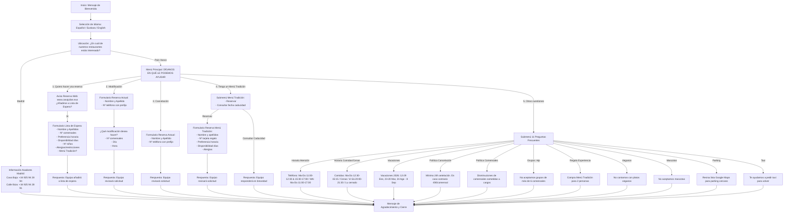

# 📊 ESPECIFICACIÓN DETALLADA DEL NUEVO FLUJO DEDUCIDO DEL DIAGRAMA
## Asador Casa Julián de Tolosa y Madrid

Documentación de análisis extraída del diagrama oficial `Diagrama-Whatsapp-casa-julian.pdf` / `diagrama.png`.

---

## 🗺️ Mapa Completo del Flujo Conversacional

---

## 📝 Textos Literales por Sección

### 1. Bienvenida y Selección de Idioma
> **Mensaje de Bienvenida:**  
> *"¡Bienvenido/a a Casa Julián! Será un placer ayudarte. ¿En qué idioma deseas continuar?"*  
> **Opciones:** `Español`, `Euskara`, `English`

### 2. Ubicación
> **Pregunta:**  
> *"¿En cuál de nuestros restaurantes estás interesado?"*  
> **Opciones:** `País Vasco`, `Madrid`  
> **Respuesta Madrid:**  
> *"Está contactando con el asador ubicado en el País Vasco. Para contactar con los asaderos de Madrid:\n\nCava Baja: +34 925 94 28 94 (Whatsapp)\nCalle Ibiza: +34 925 94 28 91 (Whatsapp)"*

### 3. Menú Principal (País Vasco)
> **Cabecera:**  
> *"DÍGANOS EN QUÉ LE PODEMOS AYUDAR:"*  
> **Opciones:**
> 1. `Quiero hacer una reserva`
> 2. `Modificación`
> 3. `Cancelación`
> 4. `Tengo un Menú Tradición`
> 5. `Otras cuestiones`

### 4. Flujos Específicos

#### A. Quiero hacer una reserva
- **Texto:** *"Para reservar haga la solicitud en www.casajulian.eus. Procederemos a revisar la disponibilidad para el día y hora indicado. De lo contrario, ¿querrá añadirse a la lista de espera?"*
- **Opción:** `Sí`
- **Datos requeridos para Lista de Espera:**
  - Nombre y apellidos
  - Nº de comensales
  - Preferencia horaria
  - Disponibilidad de días
  - Nº de niños
  - Alergias o restricciones alimentarias
  - ¿Cuenta con un menú tradición?
- **Respuesta final:** *"Nuestro equipo le añadirá a la lista de espera. En el caso de que tuviéramos alguna cancelación, le contactaremos."*

#### B. Modificación / Cancelación
- **Datos iniciales requeridos:**
  - Nombre y apellido
  - Nº teléfono (con prefijo)
- **Si elige Modificación:**
  - Pregunta: *"¿Qué modificación desea hacer?"*
  - Opciones: `Nº de comensales`, `Día`, `Hora`
  - Respuesta final: *"Nuestro equipo revisará su solicitud. Hasta que no reciba confirmación por parte nuestra su modificación no queda confirmada."*
- **Si elige Cancelación:**
  - Respuesta final: *"Nuestro equipo revisará su solicitud. Hasta que no reciba confirmación por parte nuestra su reserva no queda confirmada."*

#### C. Tengo un Menú Tradición
- **Opciones:** `Reservar`, `Consultar fecha de caducidad`
- **Si elige Reservar:**
  - Datos requeridos: Nombre y apellidos, nº de la tarjeta regalo, Preferencia horaria, Disponibilidad de días, Alergias o restricciones alimentarias.
  - Respuesta final: *"Nuestro equipo revisará su solicitud. Hasta que no reciba confirmación por parte nuestra su reserva no queda confirmada."*
- **Si elige Consultar fecha de caducidad:**
  - Respuesta final: *"Nuestro equipo revisará su solicitud. Le responderá en la menor brevedad posible."*

#### D. Otras Cuestiones (11 FAQs)
1. **Horario atención al cliente:** *"Nuestro horario de atención al cliente es:\nTeléfono: Martes - Domingo 11:00 - 12:30 & 15:30 - 17:00.\nWhatsapp: Martes - Domingo 11:00 - 17:00."*
2. **Horario de comidas y cenas:** *"Comidas: Martes - Domingo. 12:30 - 15:15.\nCenas: Viernes - Sábado. 20:00 - 21:30.\nLunes cerrado."*
3. **Periodo de vacaciones:** *"El año 2026 estaremos cerrados durante los siguientes periodos:\n- 12 de enero - 29 de enero.\n- 23 de marzo - 20 de marzo.\n- 24 de agosto - 8 de septiembre."*
4. **Política de cancelación:** *"Las cancelaciones deberán comunicarse con un mínimo de 24 horas de antelación a la hora de la reserva. En caso contrario, se aplicará un cargo de 45 € por comensal."*
5. **Política de comensales:** *"Las disminuciones en el número de comensales pueden verse sometidas a cargos adicionales."*
6. **Grupos (>6p.):** *"No aceptamos grupos de más de 6 comensales."*
7. **Regala la experiencia:** *"Si quieres regalar una comida / cena para 2 personas compra nuestro Menú Tradición."*
8. **Veganos:** *"No contamos con platos veganos."*
9. **Mascotas:** *"No aceptamos mascotas."*
10. **Parking:** *"Revisa nuestra lista de Google Maps para encontrar el parking más cercano."*
11. **Taxi:** *"En el caso de necesitar un taxi para volver, te podemos ayudar. Para ello, necesitaremos que nos lo hagas saber."*

### 5. Mensaje de Agradecimiento (Cierre Global)
> *"¡Gracias por contactar con nosotros! Esperamos haber resuelto tu consulta. Si necesitas cualquier otra cosa, estaremos encantados de ayudarte. ¡Te esperamos en Casa Julián!"*
