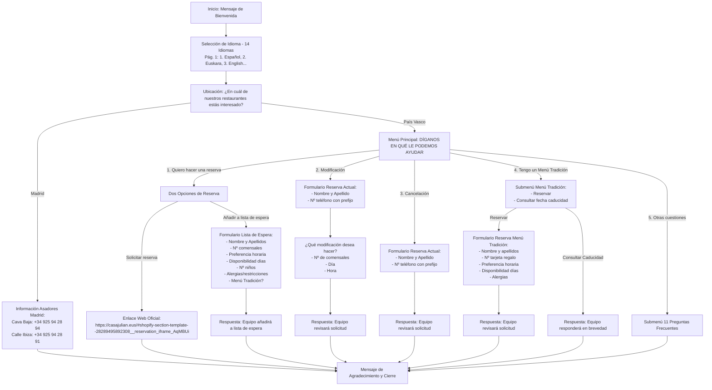

# 📊 ESPECIFICACIÓN DETALLADA DEL NUEVO FLUJO DEDUCIDO DEL DIAGRAMA
## Asador Casa Julián de Tolosa y Madrid

Documentación de análisis extraída del diagrama oficial `Diagrama-Whatsapp-casa-julian.pdf` / `diagrama.png` e incorporando las indicaciones de la dirección del restaurante.

---

## 🗺️ Mapa Completo del Flujo Conversacional

---

## 📌 Reglas de Negocio Clave

1. **Idiomas (14 Idiomas con Prioridad Inicial):**
   - El cliente puede elegir entre 14 idiomas.
   - En la primera página del menú desplegable de idiomas se posicionan en la cabecera: **1. Español**, **2. Euskara**, **3. English**.
2. **Notificaciones Internas 100% en Español:**
   - Para que el equipo de Casa Julián pueda gestionar ágilmente todas las solicitudes en sus teléfonos/tablets, **todas las alertas enviadas al personal estarán redactadas en Español**, independientemente del idioma elegido por el cliente.
3. **Flujo "Quiero hacer una reserva":**
   - El cliente dispone de 2 botones:
     - `Solicitar reserva`: Muestra el enlace web oficial `https://casajulian.eus/#shopify-section-template--28289495892308__reservation_iframe_AqMBUi`
     - `Añadir a lista de espera`: Despliega el cuestionario para registrarse en la lista de espera.
