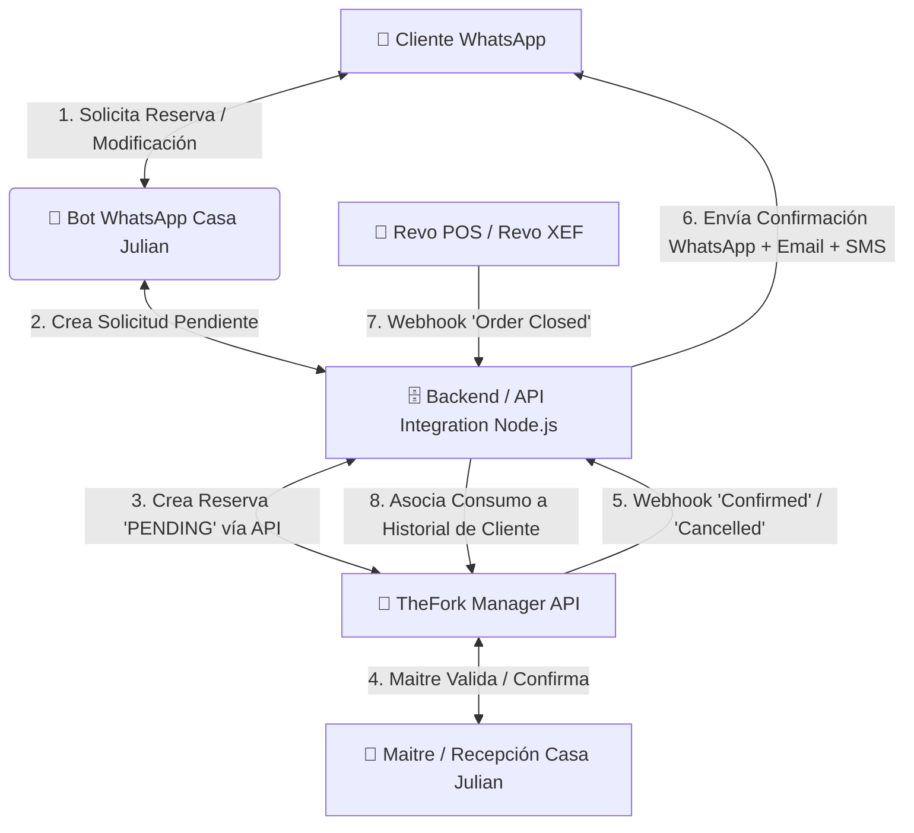

# 🏛️ PROPUESTA TÉCNICA Y ARQUITECTURA DE INTEGRACIÓN
## Asistente Virtual WhatsApp + TheFork Manager + Revo POS
### Asador Casa Julian de Tolosa

---

##  EXECUTIVE SUMMARY / RESUMEN EJECUTIVO

Los responsables de Casa Julian han definido tres requisitos estratégicos clave para la evolución del sistema:

1. **Flujo de Reserva Solicitada (Human-in-the-Loop):** El chatbot no confirmará automáticamente la reserva en la base de datos de manera autónoma, sino que registrará una **Solicitud Pendiente**. El Maitre/Equipo del restaurante revisará y validará la petición en su herramienta diaria (TheFork Manager), tras lo cual el chatbot notificará automáticamente al cliente por WhatsApp con la confirmación oficial.
2. **Integración con TheFork Manager (Gestión Unificada de Mesas):** Conectar el bot con la API de TheFork para sincronizar disponibilidades, crear solicitudes de reserva y recibir eventos de confirmación/cancelación/modificación.
3. **Enriquecimiento de Perfil VIP con Revo POS (Revo XEF):** Vincular los consumos detallados de los tickets de Revo (vinos pedidos, corte de carne, punto de asado, postres habituales) con el historial del cliente en TheFork/CRM, permitiendo un trato superpersonalizado en futuras visitas.

---

## 📐 ARQUITECTURA DE INTEGRACIÓN PROPUESTA

---

## 🛠️ PLAN DE IMPLEMENTACIÓN POR FASES

### FASE 1: Adaptación del Flujo Conversacional a "Petición Pendiente de Confirmación" (Inmediato)
- **Cambio en el Bot de WhatsApp:**
  - Al completar la fecha, hora y comensales, el estado no pasa a `CONFIRMADA`, sino a **`SOLICITUD_RECIBIDA`**.
  - **Mensaje al Cliente:**
    > *"📩 **Solicitud de Reserva Recibida**\n\nHola [Nombre], hemos recibido tu solicitud para el **[Fecha] a las [Hora]** ([Nº] personas).\n\nNuestro equipo de recepción en Asador Casa Julian revisará la disponibilidad y te enviará la **confirmación oficial por este mismo chat** en breve."*
- **Panel Ligero de Notificación para Recepción / Email:**
  - El sistema envía una alerta instantánea por email/webhook al equipo de Casa Julian con los botones rápidos `[Confirmar Reserva]` / `[Rechazar / Proponer otra hora]`.
  - Al pulsar en la alerta, el cliente recibe automáticamente el mensaje oficial en su WhatsApp:
    > *"✅ **¡RESERVA CONFIRMADA POR CASA JULIAN!**\n\nHola [Nombre], tu mesa para el **[Fecha] a las [Hora]** está confirmada. ¡Te esperamos en Tolosa!"*

---

### FASE 2: Integración Bi-direccional con TheFork Partner API (v2 / v3 OpenAPI)
- **Sincronización de Inventario en Tiempo Real:**
  - El bot consulta directamente la disponibilidad de mesas desde la API de TheFork, respetando los turnos y bloqueos fijados por el Maitre.
- **Creación de Reservas en Estado `PENDING`:**
  - La petición ingresa directamente en la pantalla de **TheFork Manager** de la tablet/ordenador del restaurante como una reserva pendiente de validar.
- **Escucha de Eventos (Webhooks de TheFork):**
  - Cuando el Maitre acepta o rechaza la reserva en TheFork Manager, TheFork emite un Webhook (`reservation.updated`).
  - El servidor de Node.js intercepta el evento y envía la plantilla de confirmación/cancelación al WhatsApp del cliente de forma transparente.

---

### FASE 3: Conexión con Revo POS (Revo XEF API) -> Perfil VIP de Fidelización
- **Captura de Consumos por Ticket (`order.closed` Webhook):**
  - Al cerrar la mesa en la comandera o TPV de Revo (iPad), Revo emite el resumen de ticket.
  - Extraemos los artículos consumidos: *Vino seleccionado (ej. Remelluri Reserva), Entrantes (Cogollos, Pimientos), Chuletones y Gramos, Postres (Tejas de Tolosa)*.
- **Histórico del Cliente (CRM de Gustos y Preferencias):**
  - El sistema vincula el número de teléfono/DNI del ticket de Revo con la ficha del cliente en TheFork.
- **Valor de Negocio Excepcional para Casa Julian:**
  - Cuando el cliente vuelve a contactar por WhatsApp o acude al restaurante, el sistema muestra al equipo:
    > *"👤 **Cliente VIP:** Juan Pérez (4ª visita)\n🍷 **Vino preferido:** Remelluri Reserva / Chivite Colección\n🥩 **Punto de carne:** Poco hecha / 1.1kg\n📊 **Gasto medio:** 95€/comensal"*

---

## 💼 PROPUESTA DE RESPUESTA PROFESIONAL PARA LOS RESPONSABLES

Puedes presentarles la siguiente respuesta ejecutiva:

> *"El planteamiento de Casa Julian es totalmente acertado y responde a la mejor práctica de la alta restauración: **mantener el control humano en la asignación de mesas mientras se automatiza la comunicación con el cliente**.*
> 
> *Nuestra propuesta se estructura en 3 hitos:*
> 
> 1. * **Inmediato:** Adaptamos el bot para que las reservas entren en modo **'Solicitud Recibida'**. El bot no confirma solo; recopila todos los datos y os envía una alerta rápida para que aprobéis o rechazéis con un solo clic, notificando automáticamente al cliente por WhatsApp.*
> 2. * **Integración TheFork API:** Conectamos el bot con vuestra aplicación de TheFork Manager. Así, las peticiones entran directo a vuestra pantalla habitual y, cuando aceptéis la reserva en TheFork, el bot envía la confirmación por WhatsApp sin que tengáis que redactar nada.*
> 3. * **Integración Revo POS (Fidelización VIP):** Capturamos los tickets cerrados en Revo XEF y asociamos las botellas de vino y platos pedidos al teléfono del cliente en TheFork. Cuando ese cliente vuelva a reservar, sabréis exactamente sus gustos y preferencias gastronómicas."*
