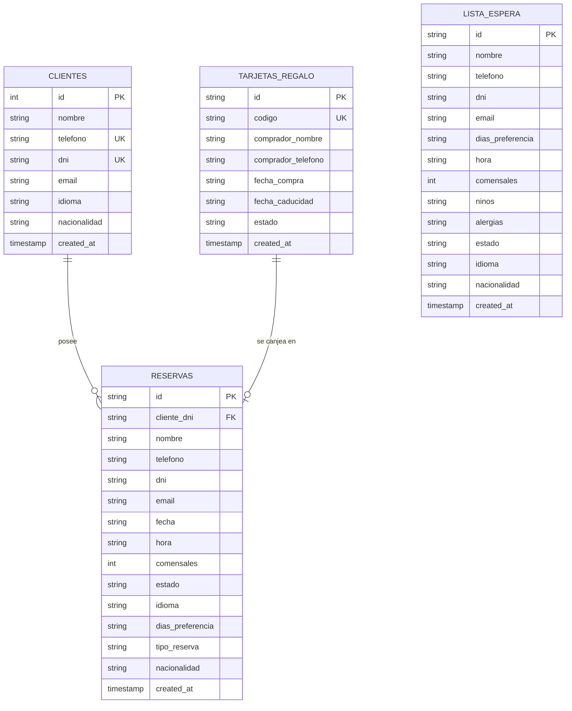

# 🗄️ Documentación de la Base de Datos - Asador Casa Julián

Este documento contiene la especificación técnica completa de la estructura de datos, tablas, columnas, tipos de datos, valores permitidos (enums) y mecanismos de sincronización en **Neon PostgreSQL** y la base de datos local de respaldo (`db.json`).

---

## 📌 Visión General de la Arquitectura de Datos

El sistema de gestión de reservas de **Asador Casa Julián** utiliza un modelo híbrido y resiliente:
1. **Neon PostgreSQL (Base de datos principal en la nube):** Motor relacional de alto rendimiento donde se persisten los registros con auto-migración al arrancar el servidor.
2. **Local JSON DB (`db.json`):** Almacenamiento local en memoria y archivo de respaldo para garantizar disponibilidad inmediata ante fallos de conexión a Internet.

---

## 📊 Diagrama Entidad-Relación (ER)



---

## 📋 Estructura Detallada de Tablas

### 1. Tabla `clientes`
Almacena el maestro de clientes que interactúan con el bot o realizan reservas.

| Columna | Tipo de Dato | Nulo | Valor por Defecto | Descripción |
| :--- | :--- | :---: | :--- | :--- |
| `id` | `SERIAL` | ❌ No | Auto-incremental | Clave primaria interna. |
| `nombre` | `VARCHAR(100)` | ❌ No | — | Nombre y apellidos del cliente. |
| `telefono` | `VARCHAR(20)` | ❌ No | — | Teléfono de contacto (clave única). |
| `dni` | `VARCHAR(20)` | ❌ No | — | DNI / NIF / Pasaporte (clave única). |
| `email` | `VARCHAR(100)` | ❌ No | — | Correo electrónico principal. |
| `idioma` | `VARCHAR(10)` | 🌐 Sí | `'es'` | Código del idioma preferido del cliente (`es`, `eu`, `en`, etc.). |
| `nacionalidad` | `VARCHAR(50)` | 🌐 Sí | `'España'` | País de procedencia / nacionalidad del cliente. |
| `created_at` | `TIMESTAMP WITH TIME ZONE` | ❌ No | `CURRENT_TIMESTAMP` | Fecha y hora de registro. |

---

### 2. Tabla `reservas`
Contiene todas las reservas formalizadas y pendientes de asignación final.

| Columna | Tipo de Dato | Nulo | Valor por Defecto | Descripción |
| :--- | :--- | :---: | :--- | :--- |
| `id` | `VARCHAR(30)` | ❌ No | — | Identificador de la reserva (ej: `RES-123456`). Clave primaria. |
| `cliente_dni` | `VARCHAR(20)` | 🌐 Sí | `NULL` | Clave foránea que referencia a `clientes(dni)`. |
| `nombre` | `VARCHAR(100)` | ❌ No | — | Nombre de la reserva. |
| `telefono` | `VARCHAR(20)` | ❌ No | — | Teléfono del titular. |
| `dni` | `VARCHAR(20)` | 🌐 Sí | `'N/A'` | DNI o pasaporte (opcional). |
| `email` | `VARCHAR(100)` | ❌ No | — | Correo electrónico del titular. |
| `fecha` | `VARCHAR(20)` | 🌐 Sí | `''` | Fecha confirmada (formato `DD/MM/AAAA`). Vacía si está sin confirmar. |
| `hora` | `VARCHAR(10)` | 🌐 Sí | `''` | Turno horario (ej: `13:30`, `20:30`). |
| `comensales` | `INT` | ❌ No | `2` | Número de comensales (máximo permitido: 6). |
| `estado` | `VARCHAR(30)` | ❌ No | `'CONFIRMADA'` | Estado de la reserva (`'CONFIRMADA'` para reservas online directas, `'PENDIENTE CONFIRMACION'` para reservas de Menú Tradición hasta que el personal las apruebe). |
| `idioma` | `VARCHAR(10)` | 🌐 Sí | `'es'` | Idioma en el que se formalizó la reserva (`es`, `eu`, `en`). |
| `dias_preferencia`| `VARCHAR(100)`| 🌐 Sí | `'Sin preferencia'` | Días preferidos indicados en el formulario. |
| `tipo_reserva` | `VARCHAR(50)` | ❌ No | `'online'` | Origen de la reserva (`online`, `tarjeta_regalo`, `lista_espera`, `telefonica`). |
| `nacionalidad` | `VARCHAR(50)` | 🌐 Sí | `'España'` | Nacionalidad del titular (`España`, `Francia`, `Reino Unido`, etc.). |
| `created_at` | `TIMESTAMP WITH TIME ZONE` | ❌ No | `CURRENT_TIMESTAMP` | Fecha y hora de creación del registro. |

---

### 3. Tabla `lista_espera`
Registra a los clientes inscritos en la lista de espera cuando no hay mesa disponible.

| Columna | Tipo de Dato | Nulo | Valor por Defecto | Descripción |
| :--- | :--- | :---: | :--- | :--- |
| `id` | `VARCHAR(30)` | ❌ No | — | Identificador único de la solicitud (ej: `ESP-654321`). Clave primaria. |
| `nombre` | `VARCHAR(100)` | ❌ No | — | Nombre del cliente solicitante. |
| `telefono` | `VARCHAR(20)` | ❌ No | — | Teléfono WhatsApp del remitente. |
| `dni` | `VARCHAR(20)` | 🌐 Sí | `'N/A'` | DNI o pasaporte (opcional). |
| `email` | `VARCHAR(100)` | 🌐 Sí | `'N/A'` | Email (si se dispone de él). |
| `dias_preferencia`| `VARCHAR(100)`| ❌ No | `'Sin preferencia'` | Hasta 3 días preferidos indicados por el cliente o `"Sin preferencia"`. |
| `hora` | `VARCHAR(10)` | 🌐 Sí | `''` | Turno preferido (ej: `14:00`, `21:00`). |
| `comensales` | `INT` | ❌ No | `1` | Número de comensales solicitados. |
| `ninos` | `VARCHAR(50)` | ❌ No | `'0'` | Número de niños indicados en la mesa (`0` si ninguno). |
| `alergias` | `TEXT` | ❌ No | `'Ninguna'` | Alergias o restricciones alimentarias notificadas por el cliente. |
| `estado` | `VARCHAR(30)` | ❌ No | `'Pendiente confirmar'`| Estado del registro (`'Pendiente confirmar'` o `'Confirmado'`). |
| `idioma` | `VARCHAR(10)` | 🌐 Sí | `'es'` | Idioma preferido para ser contactado por recepción (`es`, `eu`, `en`). |
| `nacionalidad` | `VARCHAR(50)` | 🌐 Sí | `'España'` | Nacionalidad indicada por el cliente. |
| `created_at` | `TIMESTAMP WITH TIME ZONE` | ❌ No | `CURRENT_TIMESTAMP` | Fecha y hora de inscripción. |

---

### 4. Tabla `tarjetas_regalo`
Registro maestro de tarjetas de regalo del **Menú Tradición**.

| Columna | Tipo de Dato | Nulo | Valor por Defecto | Descripción |
| :--- | :--- | :---: | :--- | :--- |
| `id` | `VARCHAR(50)` | ❌ No | — | Identificador primario de la tarjeta (ej: `TG-1001`). Clave primaria. |
| `codigo` | `VARCHAR(50)` | ❌ No | — | Código único insertado por el cliente (ej: `TR-2026-9876`). Único. |
| `comprador_nombre`| `VARCHAR(100)`| 🌐 Sí | `NULL` | Nombre de la persona que regaló el menú. |
| `comprador_telefono`|`VARCHAR(20)`| 🌐 Sí | `NULL` | Teléfono del comprador. |
| `fecha_compra` | `VARCHAR(20)` | 🌐 Sí | `NULL` | Fecha de adquisición (formato `DD/MM/AAAA`). |
| `fecha_caducidad`| `VARCHAR(20)` | 🌐 Sí | `NULL` | Fecha de vencimiento (formato `DD/MM/AAAA`). |
| `estado` | `VARCHAR(20)` | ❌ No | `'ACTIVA'` | Estado operativo de la tarjeta (`ACTIVA`, `PENDIENTE RESERVA`, `CANJEADA`, `CADUCADA`). |
| `created_at` | `TIMESTAMP WITH TIME ZONE` | ❌ No | `CURRENT_TIMESTAMP` | Fecha y hora de alta en el sistema. |

---

## ⚡ Índices de Rendimiento en PostgreSQL

```sql
CREATE INDEX IF NOT EXISTS idx_reservas_fecha_hora ON reservas(fecha, hora, estado);
CREATE INDEX IF NOT EXISTS idx_reservas_dni ON reservas(dni);
CREATE INDEX IF NOT EXISTS idx_reservas_tipo ON reservas(tipo_reserva);
CREATE INDEX IF NOT EXISTS idx_lista_espera_estado ON lista_espera(estado);
CREATE INDEX IF NOT EXISTS idx_tarjetas_codigo ON tarjetas_regalo(codigo);
```

---

## 🔄 Mecanismo de Auto-Migración

Al arrancar la aplicación en Render, el servidor Node.js ejecuta automáticamente las migraciones idempotentes:

```javascript
ALTER TABLE clientes ADD COLUMN IF NOT EXISTS idioma VARCHAR(10) DEFAULT 'es';
ALTER TABLE clientes ADD COLUMN IF NOT EXISTS nacionalidad VARCHAR(50) DEFAULT 'España';
ALTER TABLE reservas ADD COLUMN IF NOT EXISTS idioma VARCHAR(10) DEFAULT 'es';
ALTER TABLE reservas ADD COLUMN IF NOT EXISTS dias_preferencia VARCHAR(100);
ALTER TABLE reservas ADD COLUMN IF NOT EXISTS tipo_reserva VARCHAR(50) DEFAULT 'online';
ALTER TABLE reservas ADD COLUMN IF NOT EXISTS nacionalidad VARCHAR(50) DEFAULT 'España';
ALTER TABLE lista_espera ADD COLUMN IF NOT EXISTS idioma VARCHAR(10) DEFAULT 'es';
ALTER TABLE lista_espera ADD COLUMN IF NOT EXISTS estado VARCHAR(30) DEFAULT 'Pendiente confirmar';
ALTER TABLE lista_espera ADD COLUMN IF NOT EXISTS ninos VARCHAR(50) DEFAULT '0';
ALTER TABLE lista_espera ADD COLUMN IF NOT EXISTS alergias TEXT DEFAULT 'Ninguna';
ALTER TABLE lista_espera ADD COLUMN IF NOT EXISTS nacionalidad VARCHAR(50) DEFAULT 'España';
DO $$ 
BEGIN 
    IF EXISTS (SELECT 1 FROM information_schema.columns WHERE table_name='lista_espera' AND column_name='cliente_dni') THEN
        ALTER TABLE lista_espera DROP COLUMN cliente_dni;
    END IF;
END $$;
```
