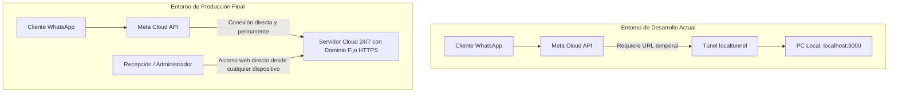

# Arquitectura de Conectividad y Webhooks: Desarrollo vs Producción

Este documento detalla el funcionamiento del túnel local en desarrollo, la transición a producción y por qué el personal de recepción nunca tendrá que preocuparse de aspectos técnicos ni de activar túneles.

---

## 1. ¿Por qué se utiliza un túnel (`localtunnel` / `ngrok`) en Desarrollo?

Cuando un cliente escribe un mensaje en WhatsApp:
1. El mensaje llega primero a los servidores mundiales de **Meta (WhatsApp Cloud API)**.
2. Meta necesita enviar ese mensaje por internet a nuestro servidor mediante una petición HTTP (*Webhook*).
3. Durante la fase de desarrollo, el servidor del bot se está ejecutando dentro de tu ordenador personal en `http://localhost:3000`. Como `localhost` es una dirección privada e invisible desde internet, Meta no puede enviar datos a tu PC directamente.
4. Por ello, herramientas como **localtunnel** o **ngrok** crean un "puente temporal" con una URL pública cifrada (por ejemplo: `https://kind-parents-write.loca.lt`) que redirige el tráfico de Meta a tu puerto `3000` en local.

> [!NOTE]
> El túnel es una **herramienta exclusiva para programadores en fase de pruebas locales**.

---

## 2. ¿Cómo funcionará en Producción?

En el entorno de producción (cuando el sistema esté desplegado de forma definitiva):

1. **Servidor Cloud Permanente:** El bot y el panel de administración estarán alojados en un servidor en la nube (como Render, AWS, Google Cloud o un VPS dedicado).
2. **Dominio Fijo y Seguro:** El servidor contará con una URL pública fija y permanente con certificado SSL (ejemplo: `https://whatsapp.casajulian.com` o `https://casa-julian-bot.onrender.com`).
3. **Webhook de Meta Fijo:** En el panel de Meta Developer se configurará esa URL fija una única vez: `https://whatsapp.casajulian.com/webhook`.
4. **Sin túneles ni dependencias locales:** **NO habrá ningún túnel activo, ni comandos que ejecutar**.

---

## 3. Experiencia para el Equipo de Recepción y Personal

El personal de recepción y los administradores **no tendrán ninguna carga técnica**:

| Aspecto | Comportamiento |
|---|---|
| **Disponibilidad** | El bot y el servidor estarán activos **24 horas al día, 365 días al año** de forma ininterrumpida. |
| **Acceso al Buzón & CMS** | Recepción solo abrirá un enlace web en su navegador habitual (ej: `https://whatsapp.casajulian.com/admin/`). |
| **Intervención Técnica** | **Cero**. No tendrán que abrir terminales, ni ejecutar comandos, ni configurar puertos o túneles. |
| **Actualizaciones y Estados** | Las notificaciones sonoras, el buzón de solicitudes y el cambio entre Modo Bot y Modo Humano funcionan de manera 100% autónoma. |

---

## 4. Resumen Comparativo

