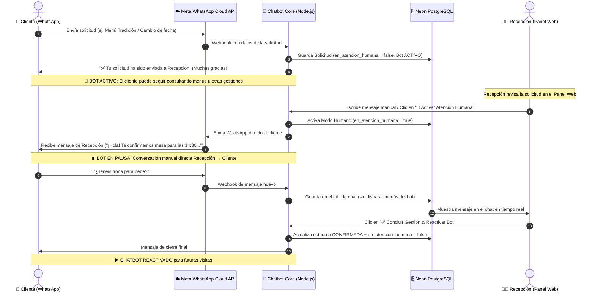

# Traspaso a Agente Humano y Conversación Bidireccional de Recepción

**Proyecto:** Asador Casa Julián de Tolosa — WhatsApp Bot & Panel CMS  
**Versión:** V196 — Modo Humano Manual / Al Iniciar Conversación de Recepción  
**Fecha:** 14 de Agosto de 2026  

---

## 1. Resumen Ejecutivo

Este documento describe la arquitectura y el funcionamiento operativo del **Modo de Traspaso a Agente Humano (*Human Handover*)** en el sistema de WhatsApp de Casa Julián de Tolosa.

### Principio de Operación:
1. **Envío de Solicitud/Consulta por el Cliente:** Cuando el cliente finaliza una solicitud (Reserva de Menú Tradición, Modificación, Cancelación o Consulta Abierta), la solicitud se registra en el Panel de Recepción pero **el chatbot permanece ACTIVO (`en_atencion_humana = false`)**. El cliente puede seguir haciendo más gestiones o consultas con el bot con total libertad.
2. **Activación de Atención Humana (Pausar Bot):** El modo humano se activa (`en_atencion_humana = true`) de dos formas:
   - **Automática al responder:** En cuanto la recepcionista escribe y envía su primer mensaje manual por WhatsApp al cliente desde el panel.
   - **Manual con un clic:** Pulsando el botón **"👤 Activar Atención Humana"** en la ventana de chat de la solicitud.
3. **Conversación Libre:** Mientras el modo humano está activo, los mensajes del cliente se dirigen al panel de recepción sin interferencia de menús automáticos.
4. **Conclusión y Reactivación:** Al finalizar la atención, la recepcionista pulsa **"✅ Concluir Gestión & Reactivar Bot"**, lo cual reactiva el chatbot (`en_atencion_humana = false`) para futuras interacciones del cliente.

---

## 2. Diagrama del Flujo de Interacción

---

## 3. Componentes del Sistema

### 3.1. Estado de Atención Humana (`en_atencion_humana`)
Cada solicitud creada en la base de datos dispone de:
* `en_atencion_humana: true`: Indica que el cliente está bajo atención personalizada.
* `mensajes: [...]`: Hilo cronológico de mensajes intercambiados (`emisor: 'cliente' | 'recepcion'`, `texto`, `fecha`).
* `estado: 'PENDIENTE' | 'EN_GESTION' | 'CONFIRMADA' | 'RECHAZADA'`.

### 3.2. Enrutador Inteligente (`bot/router.js`)
Antes de evaluar los árboles de decisión o palabras clave, el router comprueba si el número de teléfono emisor tiene una atención humana activa:
* **Si está activa:** El mensaje se guarda en el hilo de la solicitud y **el bot permanece en silencio** (no emite menús ni botones).
* **Excepción de escape para el cliente:** Si el cliente escribe `#bot`, `/menu` o `menu`, el sistema libera el modo humano y vuelve a presentar el menú principal.

### 3.3. Bandeja de Recepción en el Panel Web (`/admin`)
La recepcionista (acceso con rol `recepcion`):
1. Ve la tarjeta de la solicitud con el historial completo de mensajes.
2. Dispone de un campo de texto para redactar cualquier mensaje de forma libre.
3. Envía el WhatsApp en tiempo real a través de la API oficial de Meta.
4. Puede concluir la gestión y reactivar el bot con un solo clic.

---

## 4. Guía de Uso para el Personal de Recepción

1. **Acceder al Panel:** Abrir `http://localhost:3000/admin` (o la URL remota / Homer) e introducir la contraseña `recepcion`.
2. **Revisar Solicitudes Pendientes:** Las nuevas solicitudes aparecen automáticamente ordenadas por fecha reciente.
3. **Conversar con el Cliente:**
   * Pulsar sobre el botón **"💬 Responder por WhatsApp"**.
   * Escribir cualquier propuesta, aclaración de horarios o confirmación.
   * Las respuestas del cliente aparecerán en el hilo en tiempo real.
4. **Finalizar la Gestión:**
   * Al acordar la reserva o resolver la duda, pulsar **"✅ Concluir Gestión"**.
   * El cliente recibirá el mensaje de confirmación final y el bot quedará reactivado para sus próximas visitas.
