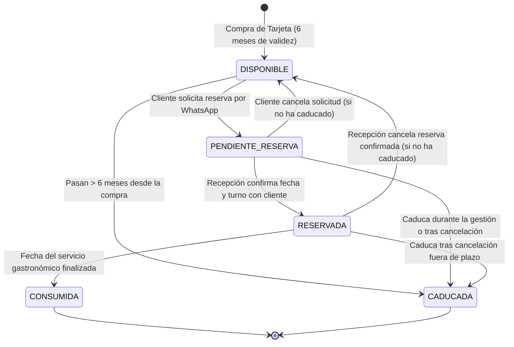

# Ciclo de Vida y Gestión de Tarjetas Regalo (Menú Tradición)

**Proyecto:** Asador Casa Julián de Tolosa — WhatsApp Bot & Panel CMS  
**Versión:** V195 — Ciclo de Vida Completo y Regla de 6 Meses de Caducidad  
**Fecha:** 14 de Agosto de 2026  

---

## 1. Resumen Ejecutivo

Este documento define el **ciclo de vida de 5 estados** de las **Tarjetas Regalo del Menú Tradición** en el sistema automatizado de WhatsApp y Panel Web de Asador Casa Julián de Tolosa.

Establece la regla estricta de **6 meses de validez desde la fecha de compra** para realizar el servicio gastronómico (comida o cena), así como las transiciones automáticas en cada etapa de la reserva, confirmación por recepción, cancelación y consumo final.

---

## 2. Los 5 Estados del Ciclo de Vida

### Detalle de cada Estado:

| Estado | Descripción | ¿Permite Reservar? |
| :--- | :--- | :---: |
| `DISPONIBLE` | Tarjeta activa y válida dentro de sus 6 meses de vigencia. Lista para ser canjeada. | ✅ Sí |
| `PENDIENTE RESERVA` | El cliente ha enviado la solicitud de reserva para el Menú Tradición a través del chatbot. En espera de revisión por el personal de Recepción. | ⏳ En trámite |
| `RESERVADA` | Recepción ha validado la disponibilidad, aclarado detalles con el cliente y confirmado la mesa, fecha y turno definitivos. | 🔒 Bloqueada |
| `CONSUMIDA` | Ha transcurrido la fecha y hora del servicio gastronómico reservado. El cliente ya ha disfrutado del Menú Tradición en el asador. | ❌ Ya utilizada |
| `CADUCADA` | Han transcurrido más de 6 meses desde la fecha de compra de la tarjeta sin que se haya disfrutado el servicio. | ❌ No válida |

---

## 3. Regla de 6 Meses de Caducidad

* **Cálculo Automático:** Desde el día de compra (`fecha_compra`), el sistema calcula exactamente **6 meses naturales** para la `fecha_caducidad`.
  * *Ejemplo:* Si una tarjeta se compra el `01/01/2027`, la fecha límite máxima de consumo es el `01/07/2027`.
* **Condición de Consumo:** Tanto la reserva como la comida o cena deben disfrutarse **antes de que finalice la fecha de caducidad**.
* **Validación en Tiempo Real en WhatsApp:**
  * Si un cliente introduce un código caducado, el chatbot le informa inmediatamente:
    > *"⚠️ La tarjeta regalo **TR-XXXX** está **CADUCADA** (plazo máximo de 6 meses superado, válida hasta DD/MM/AAAA). Por favor, introduce otro código:"*
  * En la comprobación de caducidad del menú, se muestra el estado y la fecha exacta con total transparencia.

---

## 4. Transiciones y Casuísticas Operativas

### 4.1. Solicitud de Reserva (Cliente en WhatsApp)
1. El cliente introduce su código de tarjeta regalo.
2. El bot valida que la tarjeta esté en estado `DISPONIBLE` y que no haya caducado.
3. El cliente completa sus preferencias de fechas, turno, número de comensales y alergias.
4. Al pulsar **"Sí, enviar"**:
   * La tarjeta pasa inmediatamente a `PENDIENTE RESERVA`.
   * Se crea la solicitud en la Bandeja de Recepción del panel web.

### 4.2. Confirmación por Recepción (Panel Web)
1. La recepcionista abre la solicitud en `http://localhost:3000/admin`.
2. Puede conversar por WhatsApp con el cliente para acordar la hora y mesa exacta.
3. Al pulsar **"✅ Concluir Gestión & Reactivar Bot"** (o cambiar el estado a `CONFIRMADA`):
   * La tarjeta regalo vinculada pasa automáticamente a `RESERVADA`.

### 4.3. Cancelación de Reserva
* Si la solicitud o la reserva confirmada es cancelada:
  * El sistema comprueba si la tarjeta aún se encuentra dentro de sus 6 meses de validez:
    * **Si está en plazo:** La tarjeta vuelve automáticamente a `DISPONIBLE` para que el cliente pueda volver a utilizarla en otra ocasión.
    * **Si ya han pasado los 6 meses:** La tarjeta pasa a `CADUCADA`.

### 4.4. Consumo Final del Servicio
* Una vez transcurrido el día del servicio en el restaurante, la tarjeta pasa de forma definitiva a `CONSUMIDA`.

---

## 5. Endpoints de Consulta y Gestión

* `GET /api/admin/tarjetas-regalo`: Devuelve el listado completo de tarjetas, comprador, fechas y estado actualizado en tiempo real.
* `POST /api/admin/solicitudes/:id/concluir`: Concluye la solicitud y actualiza la tarjeta a `RESERVADA`.
* `POST /api/admin/solicitudes/:id/estado`: Gestiona el paso a `CONFIRMADA`, `CANCELADA` o `RECHAZADA` aplicando las reglas de reactivación a `DISPONIBLE` o `CADUCADA`.
