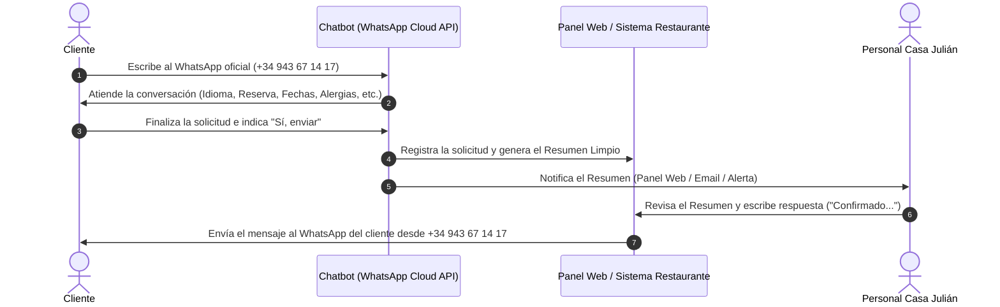

# Arquitectura y Operativa en Producción: Gestión de Solicitudes y Atención Humana en WhatsApp (+34 943 67 14 17)

## 📌 1. Visión General del Sistema en Producción

Cuando el desarrollo se ponga en marcha con el número oficial del restaurante (**+34 943 67 14 17**), el sistema funcionará mediante la **API de WhatsApp Cloud oficial de Meta**. 

La arquitectura está diseñada para automatizar la recopilación de datos y dejar al personal del restaurante únicamente la tarea de revisar y confirmar la solicitud final mediante una respuesta manual transparente desde el mismo número oficial.

---

## 🔄 2. Flujo Operativo Paso a Paso



---

## 🛠️ 3. ¿Cómo Funciona la Atención Humana desde la API de Meta?

### 📱 Diferencia entre App Móvil Convencional y WhatsApp Cloud API
1. **App Móvil Tradicional (Antes):** El trabajador abría la app móvil de WhatsApp Business en el teléfono físico y escribía mensaje por mensaje a cada cliente.
2. **WhatsApp Cloud API (Producción):** Al conectar el número `+34 943 67 14 17` a la API oficial de Meta para el chatbot, el número es gestionado de forma centralizada.
3. **Bandeja de Atención del Restaurante:** El personal responderá a los clientes desde el **Panel de Administración Web del Chatbot** (`/admin`) o bandeja de atención conectada, accesible desde cualquier ordenador, tablet o navegador del restaurante.

---

## 💬 4. Experiencia del Cliente y del Trabajador

### 👤 Para el Cliente (100% Transparente):
- Escribe al número oficial del restaurante (`+34 943 67 14 17`).
- Es guiado por el chatbot para recopilar todos sus datos en menos de 1 minuto.
- Cuando el trabajador del restaurante le responde desde el Panel Web, el cliente recibe el mensaje **directamente en su WhatsApp personal desde el número oficial de Casa Julián (+34 943 67 14 17)** como una conversación totalmente normal.

### 👨‍🍳 Para el Trabajador del Restaurante (Ahorro Masivo de Tiempo):
- **Cero mensajes innecesarios:** Ya no tiene que cruzar 10 mensajes preguntando nombre, fecha, hora, comensales o alergias.
- **Resumen Masticado:** Le llega únicamente un **resumen estructurado y limpio** de la petición:
  ```text
  📋 SOLICITUD DE RESERVA RECIBIDA
  👤 Titular: Juan Pérez
  📞 Teléfono: +34 612 34 56 78
  👥 Comensales: 4 (0 niños)
  📅 Fechas preferencia: 15/09/2026, 16/09/2026
  🍽️ Servicio: Comida (14:00h)
  ⚠️ Alergias: Intolerancia al gluten
  ```
- **Respuesta en 1 Clic:** El trabajador solo debe pulsar "Aprobar / Responder", teclear un mensaje rápido (*"Confirmado Juan, os esperamos el 15/09 a las 14:00h"*) y el cliente lo recibe en su WhatsApp.

---

## ⭐ 5. Ventajas Clave de esta Arquitectura

1. **Atención Multidispositivo:** Múltiples trabajadores pueden estar en el panel desde ordenadores o tablets diferentes a la vez sin depender de un único teléfono móvil físico.
2. **Cero Saturación:** El chat no se llena de preguntas repetitivas sobre horarios, carta o dudas frecuentes (el chatbot responde las FAQs automáticamente).
3. **Historial Centralizado:** Todas las solicitudes y respuestas quedan guardadas en la base de datos para auditoría y consulta.
