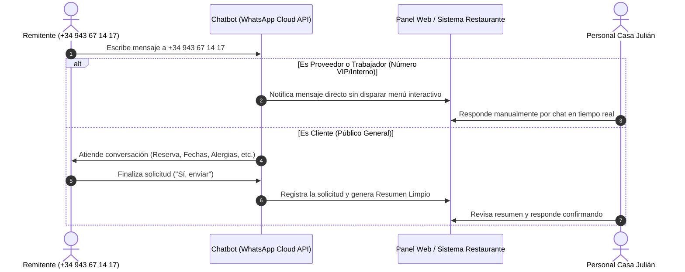

# Arquitectura y Operativa en Producción: Gestión de Solicitudes, Atención Humana y Clasificación de Contactos (Proveedores / Personal) en WhatsApp (+34 943 67 14 17)

## 📌 1. Visión General del Sistema en Producción

Cuando el desarrollo se ponga en marcha con el número oficial del restaurante (**+34 943 67 14 17**), el sistema funcionará mediante la **API de WhatsApp Cloud oficial de Meta**.

La arquitectura está diseñada para:

1. **Atender a los Clientes automáticamente** mediante el chatbot para recopilar sus solicitudes de reserva, modificación, cancelación o consultas generales.
2. **Permitir a Proveedores y Trabajadores del Restaurante comunicarse de forma manual directa**, desviando o pausando el chatbot para esos contactos específicos sin interrupciones automatizadas.

---

## 🔄 2. Flujo Operativo y Clasificación de Contactos

---

## 🏬 3. Coexistencia de Atenciones: Clientes vs Proveedores / Trabajadores

### ¿Es posible mantener la atención manual habitual para proveedores y personal?

**Sí, 100% posible.** Existen dos mecanismos complementarios para lograrlo de forma completamente fluida:

### 🅰️ Opción A: Lista Blanca de Teléfonos (Whitelist / Contactos VIP)

- Se registran los números de proveedores habituales, distribuidores y teléfonos personales de la plantilla en el sistema/Panel Web.
- **Funcionamiento:** Cuando entra un WhatsApp desde un número de la lista VIP:
  - **El chatbot NO salta ni envía menús interactivos.**
  - Llega directamente una alerta de chat al Panel de Atención para que el personal del restaurante hable de tú a tú con el proveedor o trabajador.

### 🅱️ Opción B: Modo Pausa / Control Humano en el Panel Web

- Cualquier conversación con un cliente, proveedor o contacto nuevo puede ser **pausada manualmente** por el trabajador con un clic en el Panel (`Pausar Chatbot`).
- Durante la pausa, el bot se inhibe por completo y todo el diálogo funciona como un chat manual de WhatsApp Business entre el restaurante y la persona.

---

## 🛠️ 4. ¿Cómo Funciona la Atención Humana desde la API de Meta?

### 📱 Diferencia entre App Móvil Convencional y WhatsApp Cloud API

1. **App Móvil Tradicional (Antes):** El trabajador abría la app móvil de WhatsApp Business en el teléfono físico y escribía mensaje por mensaje a cada cliente o proveedor.
2. **WhatsApp Cloud API (Producción):** Al conectar el número `+34 943 67 14 17` a la API oficial de Meta para el chatbot, el número es gestionado de forma centralizada.
3. **Bandeja de Atención del Restaurante:** El personal responderá a clientes y proveedores desde el **Panel de Administración Web del Chatbot** (`/adminn`e) o bandeja de atención conectada, accesible desde cualquier ordenador, tablet o navegador del restaurante.

---

## 💬 5. Experiencia de Cada Tipo de Usuario

| Tipo de Usuario              | Experiencia en WhatsApp                                                                        | Atención en el Restaurante                                                    |
| :--------------------------- | :--------------------------------------------------------------------------------------------- | :----------------------------------------------------------------------------- |
| **Cliente General**    | Recibe el menú interactivo, selecciona fechas/alergias y envía solicitud.                    | Recibe el**Resumen Limpio** de reserva y responde confirmando en 1 clic. |
| **Proveedor habitual** | Escribe un mensaje directo sin menús automáticos (*"Hola, mañana llevo los chuletones"*). | Responde manualmente desde el Panel Web como en un chat tradicional.           |
| **Trabajador interno** | Escribe un mensaje directo sobre turnos, horarios o notas internas.                            | Responde manualmente desde el Panel Web.                                       |

---

## ⭐ 6. Ventajas Clave de esta Arquitectura

1. **Atención Multidispositivo:** Múltiples trabajadores pueden estar en el panel desene ordenadores o tablets diferentes a la vez sin depender de un único teléfono móvil físico.
2. **Cero Saturación:** El chat no se llena de preguntas repetitivas sobre horarios, carta o dudas frecuentes (el chatbot responde las FAQs automáticamente).
3. **Trato Personalizado:** Proveedores y personal conservan la comunicación directa de siempre sin lidiar con preguntas del bot.
4. **Historial Centralizado:** Todas las solicitudes y respuestas quedan guardadas en la base de datos para auditoría y consulta.
